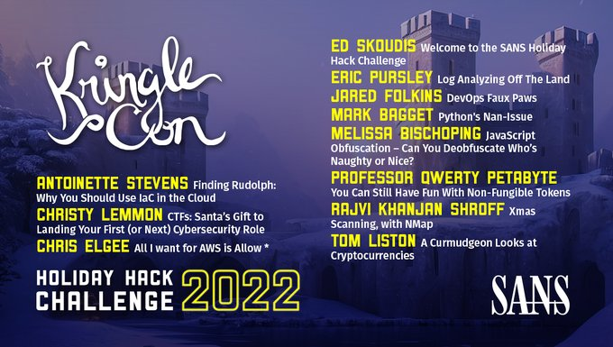
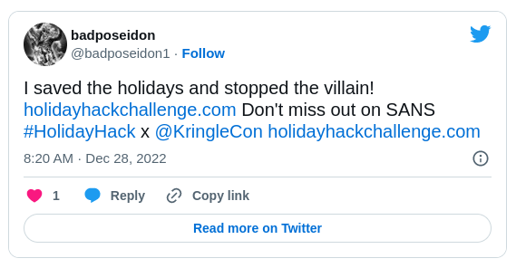

<!-- Improved compatibility of back to top link: See: https://github.com/othneildrew/Best-README-Template/pull/73 -->

<!-- PROJECT LOGO -->
 

  <h3 align="center">SANS - Holiday Hack Challenge 2022</h3>

  

  

    Find in the link below, the step-by-step for complete this challenge!
     
    <a href="https://github.com/brunopelegrini/SANS-Holiday-Hack-Challenge-2022/tree/main/Writeups"><strong>Explore the write-ups! »</strong></a>
     
  

<!-- ABOUT THE PROJECT -->
## About The Project

This is my first time in a CTF and I believe that when a person write a writeup they learned a lot! 

Here's why:
* For help you, help another peoples that have asks about this topic.
* To help me, with english language, with written and learn about another topics of technology.
* For help community of technology that searching for articles with details.
* Documented this fun challenge :smile:
* Because:

  

<!-- CONTACT -->
## Contact

Twitter - [@badposeidon1](https://twitter.com/badposeidon1)
Project Link: [https://github.com/brunopelegrini/SANS-Holiday-Hack-Challenge-2022](https://github.com/brunopelegrini/SANS-Holiday-Hack-Challenge-2022)
